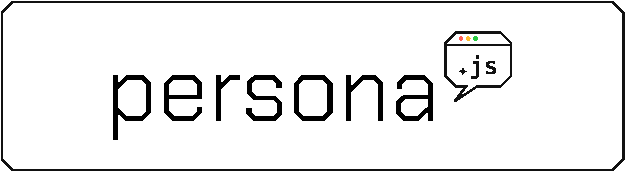
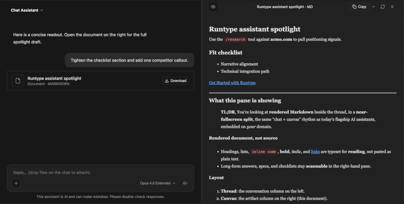

<p align="center">
  
</p>

[](https://www.npmjs.com/package/@runtypelabs/persona)
[](https://persona-chat.dev)
[](https://deepwiki.com/runtypelabs/persona)

A themeable, pluggable AI chat widget for websites: built in TypeScript with zero framework dependencies. It renders using Vanilla JS. Its initial bundle tries hard to be small.

Persona gives you a drop-in UI for your AI assistant that works on basically any site or product on the web. It ships with support for streaming responses, direct client-token installs, WebMCP/page tools, built-in local client tools, voice I/O, multi-modal content, tool call visualization, approval gates, artifact rendering, safe markdown/HTML rendering, and a plugin system so you can customize every layer of the UI.

<p align="center">
  
</p>

Persona works with any SSE-capable backend. See the "examples" section below for pre-built framework / platform / frontend combos.

*Built something cool that you'd like to contribute back? Awesome! We'd love that.*

## Live demo

**[persona-chat.dev](https://persona-chat.dev)** hosts the interactive showcase: streaming chat, voice, docked and fullscreen layouts, themes, tool calls, artifacts, and more. It's the hosted version of [`apps/web`](./apps/web). To run the same pages on your machine with hot reload while you edit code, run `pnpm dev` from the repository root: the Vite dev server reloads the demo, and the app resolves `@runtypelabs/persona` from the workspace (`packages/widget`), so widget changes apply without publishing to npm.

## When should you use this?

If you want to create AI experiences quickly within your site or app, configured in a declarative manner, and love building with plain TS/JS hooks... Persona will be one of your best friends!

This includes layering on top of what's already been built with React, Vue, or any other FE framework. Persona is lightweight and is built to work alongside.

That said, if you really don't like the idea of building AI without JSX... you probably want to check out Assistant UI, CopilotKit, or Vercel's AI Elements. No worries, Persona still thinks you are cool.

## Packages

| Package | npm | Description |
|---------|-----|-------------|
| [`packages/widget`](./packages/widget) | `@runtypelabs/persona` | The installable chat widget |
| [`packages/proxy`](./packages/proxy) | `@runtypelabs/persona-proxy` | Optional Hono-based proxy server for flow configuration |

## Apps

| App | Platform | Description |
|-----|----------|-------------|
| [`apps/web`](./apps/web) | Vite | The Persona showcase: 35+ interactive demo pages ([live](https://persona-chat.dev)) |

## Examples

| Example | Platform | Description |
|---------|----------|-------------|
| [`examples/ai-sdk-webmcp`](./examples/ai-sdk-webmcp) | Next.js | WebMCP page tools using Vercel AI SDK ([live](https://ai-sdk-webmcp.persona-chat.dev)) |
| [`examples/ai-sdk-next`](./examples/ai-sdk-next) | Next.js | Minimal SSE adapters for AI SDK and OpenAI Responses |
| [`examples/eve-next`](./examples/eve-next) | Next.js | Vercel [eve](https://github.com/vercel/eve) agent backend (beta; needs Node 24 + a running eve server) |
| [`examples/openai-agents-next`](./examples/openai-agents-next) | Next.js | OpenAI Agents SDK (`@openai/agents`) backend |
| [`examples/langgraph-next`](./examples/langgraph-next) | Next.js | LangGraph.js (`@langchain/langgraph`) backend |
| [`examples/echo-hono`](./examples/echo-hono) | Hono | Host matrix: same adapter on Hono (Node/Bun/Deno/Workers) |
| [`examples/echo-script-tag`](./examples/echo-script-tag) | Bare HTML + `node:http` | Host matrix: zero-framework `<script>` install + bare Node backend |
| [`examples/echo-express`](./examples/echo-express) | Express | Host matrix: the `(req, res)` callback-style bridge |
| [`examples/echo-sveltekit`](./examples/echo-sveltekit) | SvelteKit | Host matrix: one-line `+server.ts` Web-standard route |
| [`examples/runtype-script-tag`](./examples/runtype-script-tag) | Static / Runtype | Hosted backend: a `clientToken` embed with no backend at all |
| [`examples/runtype-hono-proxy`](./examples/runtype-hono-proxy) | Hono (Node / Vercel / Workers) | Runtype API proxy: powers local dev and `proxy.persona-chat.dev` |

## Bring Your Own Backend

Persona is designed to be backend-agnostic. You can plug it into any streaming agent or model SDK using the Persona SSE protocol.

Prefer not to run a backend at all? [`examples/runtype-script-tag`](./examples/runtype-script-tag) embeds the widget against a hosted Runtype backend with a browser-safe `clientToken`. No server code: the direct counterpart to the self-hosted [`echo-script-tag`](./examples/echo-script-tag) example.

### Featured Adapters

Backend adapters in this repo, each emitting Persona's SSE wire from a different SDK:

- [**Vercel Eve**](./examples/eve-next): Vercel's filesystem-first agent framework (beta; Node 24 + a running eve server).
- [**OpenAI Agents**](./examples/openai-agents-next): Official OpenAI Agents SDK integration.
- [**LangGraph.js**](./examples/langgraph-next): LangChain's orchestration framework.
- [**AI SDK & OpenAI Responses**](./examples/ai-sdk-next): Minimal stream adapters, plus [choosing a model/assistant with `target`](./examples/ai-sdk-next#choosing-a-modelassistant-with-target).

More adapters (Anthropic Claude Agent SDK, Google Gen AI, Mastra, Cloudflare Agents) live in [**`runtypelabs/persona-examples`**](https://github.com/runtypelabs/persona-examples).

### Host Matrix

The adapter is a plain Web `(Request) => Response`, so it runs anywhere, not just React. These four examples re-host **the same canonical agent**: each uses the same `persona-wire.ts` and adapter, and only the thin host wrapper changes. Diff them to see exactly what each framework needs (and what it gives you for free). All four run with **no API key** (a zero-dependency echo agent, with a documented one-line swap to a real model).

- [**Hono**](./examples/echo-hono): one `app.fetch` handler that runs on Node, Bun, Deno, and Cloudflare Workers.
- [**Bare HTML + `<script>`**](./examples/echo-script-tag): no framework, no bundler: the drop-in script-tag install over a bare `node:http` backend.
- [**Express**](./examples/echo-express): the callback-style host. It shows the `(req, res)` → Web `Response` bridge.
- [**SvelteKit**](./examples/echo-sveltekit): a one-line Web-standard `+server.ts` route.

### Protocol Documentation

- [**WebMCP without Runtype**](./docs/webmcp-without-runtype.md): Deep dive into streaming the Persona protocol over the Vercel AI SDK.
- [**Durable session reconnect**](./docs/durable-reconnect.md): Resume a dropped durable agent turn (any resumable, server-persisted execution, e.g. Claude Managed agents or async/background runs) from the SSE cursor, including the tab-reload persistence handshake.
- [**Adapter SDK Minimal**](./examples/ai-sdk-next): Minimal reference implementations for AI SDK and OpenAI Responses, including [choosing a model/assistant with `target`](./examples/ai-sdk-next#choosing-a-modelassistant-with-target).

## Quick Start

```bash
corepack enable
pnpm install
pnpm dev
```

This starts the proxy on `http://localhost:43111` and the demo app at `http://localhost:5173`. Both depend on the local widget package via workspace linking, so changes hot-reload without publishing.

> **Note:** Requires Node.js 20+ (`nvm use` reads `.nvmrc`). Corepack manages pnpm for you.

### Install from npm

```bash
npm install @runtypelabs/persona        # widget
npm install @runtypelabs/persona-proxy   # proxy (optional)
```

## Three primary layouts

While Persona supports much more, the majority of the frontend AI experiences you see fit into the three buckets below. We recommend starting here.

You move between them by changing the `launcher` config:

- **Floating** (the default): a launcher in the corner that opens a floating panel. The entry point for support, docs, sales, or onboarding, no layout config required.
- **Docked:** a copilot docked beside your app. Wrap a page region and reveal a side panel that resizes, pushes, or overlays your layout.
- **Fullscreen:** a full-height assistant that owns the page. Fill a container as an app surface, with an optional artifact split.

**With npm** (any bundler):

```ts
import { initAgentWidget } from "@runtypelabs/persona";

// 1. Floating: the launcher in the corner is the default
initAgentWidget({ target: "#chat", config: { apiUrl } });

// 2. Docked: wrap a region, reveal a side panel
initAgentWidget({
  target: "#workspace",
  config: { apiUrl, launcher: { mountMode: "docked", dock: { side: "right", width: "420px" } } },
});

// 3. Fullscreen: turn the launcher off, let the widget own the page
initAgentWidget({
  target: "#app",
  config: { apiUrl, launcher: { enabled: false, fullHeight: true } },
});
```

**Or with a script tag** (no build step): the same config via `window.siteAgentConfig`, and the installer loads the widget and its CSS for you. Swap in the same `launcher` field for docked or fullscreen.

```html
<script>
  window.siteAgentConfig = {
    target: "#chat",
    apiUrl: "https://your-api.com/chat",
    // floating launcher is the default
  };
</script>
<script src="https://cdn.jsdelivr.net/npm/@runtypelabs/persona@4/dist/install.global.js"></script>
```

See the live [launcher](https://persona-chat.dev/launcher-demo.html), [docked panel](https://persona-chat.dev/docked-panel-demo.html), and [fullscreen assistant](https://persona-chat.dev/fullscreen-assistant-demo.html) demos. The [widget configuration reference](./packages/widget/README.md) covers `mountMode`, every `dock.reveal` mode (`resize`, `emerge`, `overlay`, `push`), and the docked height contract. 

## Features

Everything below is opt-in and configurable via the widget config, feature flags, or the plugin system.

### Streaming Chat
SSE-based message streaming with pluggable parsers (plain text, JSON, XML, regex). Bring your own stream parser or use the built-ins. Supports partial JSON parsing for incomplete chunks, configurable dispatch-failure copy via `errorMessage`, and optional stream reveal animations (`typewriter`, `letter-rise`, `word-fade`, `wipe`, `glyph-cycle`, `pop-bubble`, or custom plugins).

### Multi-Modal Content
Text, images (PNG, JPEG, GIF, WebP, SVG), and documents (PDF, DOCX, TXT, CSV, JSON, Excel). Configure allowed file types, size limits, and previews through the attachments config.

### Voice Input & Output
Optional speech-to-text via the Web Speech API or Runtype's WebSocket voice service with barge-in interruption and voice activity detection. Text-to-speech playback for assistant responses: auto-speak via `textToSpeech`, or a per-message "Read aloud" button with play/pause/resume via `messageActions.showReadAloud`. TTS is backed by a pluggable `SpeechEngine` (browser Web Speech API by default, or a hosted engine via `textToSpeech.createEngine`). Enable via `voiceRecognition` and `textToSpeech`.

### Reasoning & Extended Thinking
Collapsible reasoning bubbles that display model chain-of-thought with duration tracking and streaming. Controlled by `features.showReasoning`: on by default, or override the renderer with a plugin hook.

### Tool Calls, Approvals & Local Client Tools
Expandable tool call bubbles showing name, status, arguments, and results, with compact display modes, active previews, grouping, and loading animations. Optional human-in-the-loop approval bubbles include friendly summaries, hidden/collapsed technical details, agent-stated reasons, and custom approve/deny handlers. Built-in LOCAL client tools (`ask_user_question` and `suggest_replies`) can be advertised from the widget with `features.askUserQuestion.expose` and `features.suggestReplies.expose`.

### Artifacts
Optional side-panel for rendering markdown and component content. Desktop split layout (resizable, with an optional expand-to-full-width toolbar toggle via `layout.showExpandToggle`) or mobile drawer. Enable via `features.artifacts`, configure toolbar presets, copy behavior, and appearance.

### Event Stream Inspector
Optional real-time event capture with search/filter, badge coloring, timestamps, expandable payloads, and output-throughput diagnostics. Enable via `features.showEventStreamToggle`. Customize rows, toolbar, and payload rendering through plugin hooks.

### Composer, Scrolling & Keyboard Shortcuts
`Enter` sends a message (`Shift+Enter` for a newline) and is inert while a response is streaming: it never interrupts generation. Press `Esc` within the widget to stop an in-flight response (the visible Stop button does the same). `Up`/`Down` navigate previously sent messages for quick re-entry or editing: entered only when the caret is at the start of the input, so multi-line editing is preserved, and your in-progress draft is restored when you page back to the present. History navigation is on by default; disable via `features.composerHistory: false`. Streaming scroll behavior is configurable with `features.scrollBehavior` (`follow`, `anchor-top`, or `none`), and the shared scroll-to-bottom affordance shows a new-message count while you're scrolled away.

### Themes & Styling
Light and dark themes included. Full design token system (palette, semantic, component-level) with CSS variable support. Extend with built-in plugins for accessibility, reduced motion, high contrast, and branding, or create your own.

### Layout, Docking & Fast Script Installs
Start from a built-in preset (shop, minimal, fullscreen) or configure from scratch. Header layouts, message layouts, avatars, timestamps, and slot-based rendering are all customizable. Dock as a floating widget, wrap a page region with a side panel (`resize`, `emerge`, `overlay`, or `push` reveals with a `dock.maxHeight` viewport guard), or embed inline. Script-tag installs paint a tiny real launcher first and defer the full panel bundle until first open when the config allows it.

### Plugin System
14 render hooks covering the launcher, header, composer, messages, reasoning, tool calls, ask-user-question sheets, approvals, loading/idle indicators, and the event stream. Priority-based ordering with automatic fallback to defaults. Replace any piece of the UI without forking; use the optional `@runtypelabs/persona/plugin-kit` helpers for Shadow-DOM-safe styles and popovers.

### Extending Persona
Persona ships various ways to extend it. Plugins, an inline component registry, postprocessors, theme plugins, stream parsers and animations, voice providers, sanitization hooks, action parsers/handlers, context providers/WebMCP, layout slots, and a storage adapter are all replaceable seams. The [Extending Persona](./packages/widget/docs/EXTENDING.md) guide maps every extension point to its public API and deep-dive doc; [Authoring Plugins](./packages/widget/docs/PLUGINS.md) covers building your own.

### Feedback & Analytics
Optional message-level upvote/downvote/copy with automatic backend submission in client-token mode. CSAT and NPS survey components. Script-tag lifecycle callbacks/events (`onScriptLoad`, `onLauncherShown`, `onChatReady`, `onError`) and controller events make it easy to wire custom analytics.

### Component System
Register custom components and render them inline via directives. Stream-aware parser and middleware support dynamic UI insertion during streaming, with live DOM element hydration so event listeners survive transcript re-renders.

### Message Injection, Context & Page Tools
Programmatically insert messages (`injectMessage`, `injectAssistantMessage`, `injectUserMessage`, `injectSystemMessage`) with dual-content support: display one thing to the user while sending different content to the LLM. Inject page/editor context with `contextProviders` and `requestMiddleware`; use `webmcp: { enabled: true }` to expose page actions through `document.modelContext`. For richer page context, import the optional `@runtypelabs/persona/smart-dom-reader` provider.

## Extending & contributing

Built a plugin, theme, backend adapter, or product with Persona? See the
extensibility map ([EXTENDING.md](./packages/widget/docs/EXTENDING.md)) and
[CONTRIBUTING.md](./CONTRIBUTING.md). While Persona is launching, please
contribute customizations back to this monorepo as demos, examples, docs, or
package changes so the ecosystem grows in one place.

## Proxy Deployment

Both proxy examples handle secure API key management, CORS, and multiple flow configurations.

- **runtype-hono-proxy**: Runtype API proxy on Hono. Node (`pnpm dev`), Vercel (`api/`), or Cloudflare Workers (`pnpm dev:runtype-workers`)

## Publishing

This monorepo uses [Changesets](https://github.com/changesets/changesets) for version management.

```bash
pnpm changeset            # create a changeset after making changes
pnpm changeset version    # bump versions and generate changelogs
pnpm release              # maintainer-only release workflow
```

See [`packages/widget/README.md`](./packages/widget/README.md) for the full configuration reference.

## License

MIT
