## Verify skill: proof run

branch `chore/verify-skill` · captured at `743db1bc6b + uncommitted changes (d2469835ce66)` · run `20261004-053630` · apps/web vite dev (widget from source), keyless fixture

| Feature | Result | Note |
| --- | --- | --- |
| approvals | ✅ verified | Allow: card → tool → reply; 1 chat request + 1 approved decision; approval:resolved fired 8x (known finding) |
| voice-runtype | ✅ verified | server heard the spoken question; widget played 2760 ms of reply speech (script 2661 ms, peak -2.6 dB); first mic frame 285 ms after socket open; clean hang-up (cancel, close 1000) |
| voice-browser | ✅ verified | scripted recognizer → composer → auto-submit after 800 ms pause → reply; speechSynthesis given Markdown-free text |
| streaming | ⏭️ not driven | not driven in this run (fixture scenarios proven during development) |

### approvals

**allow flow**

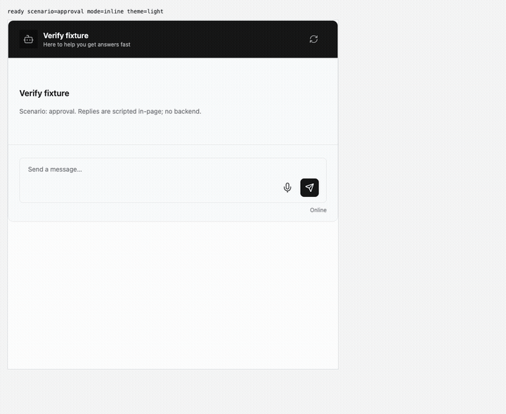

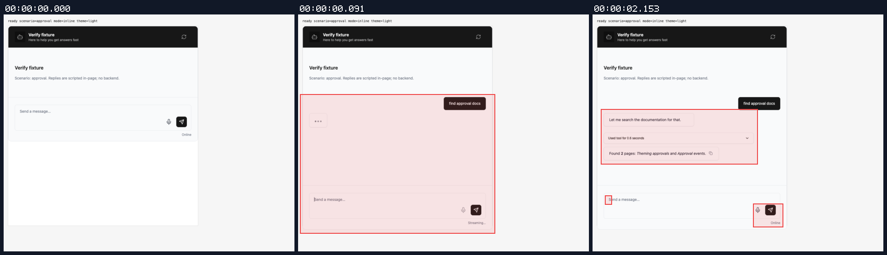

[`01-approvals-allow-flow.webm`](./01-approvals-allow-flow.webm)

**card pending**

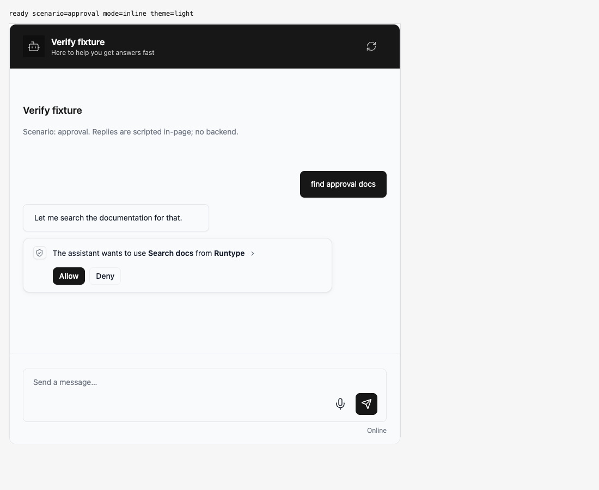

[`02-approvals-card-pending.aria.txt`](./02-approvals-card-pending.aria.txt)

**after allow**

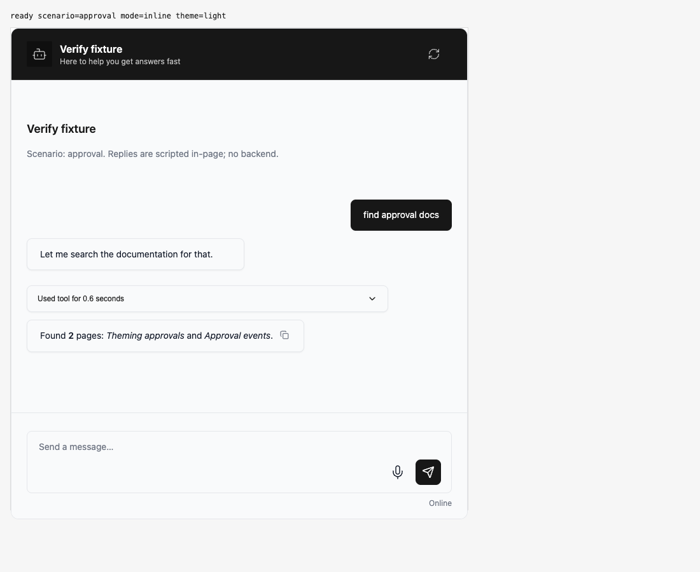

[`03-approvals-after-allow.aria.txt`](./03-approvals-after-allow.aria.txt)

**allow side effects**: 2 request(s) crossed the network boundary, 14 controller event(s)

[`04-approvals-allow-side-effects.page.json`](./04-approvals-allow-side-effects.page.json)

### voice-runtype

**call**

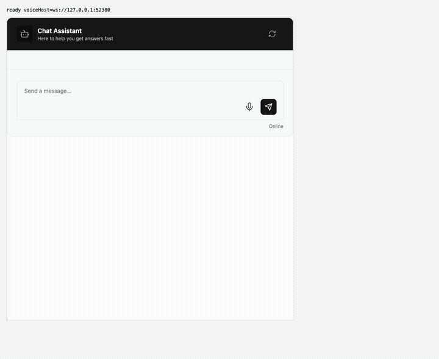

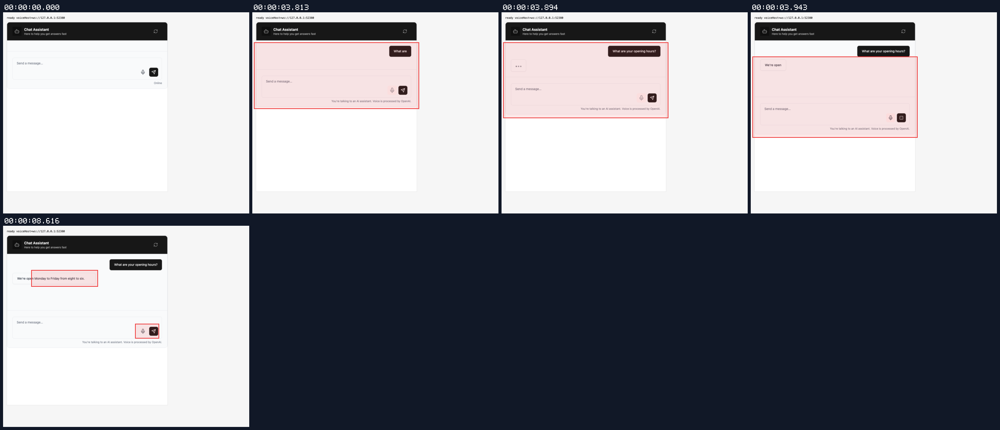

[`05-voice-runtype-call.webm`](./05-voice-runtype-call.webm)

**after call**

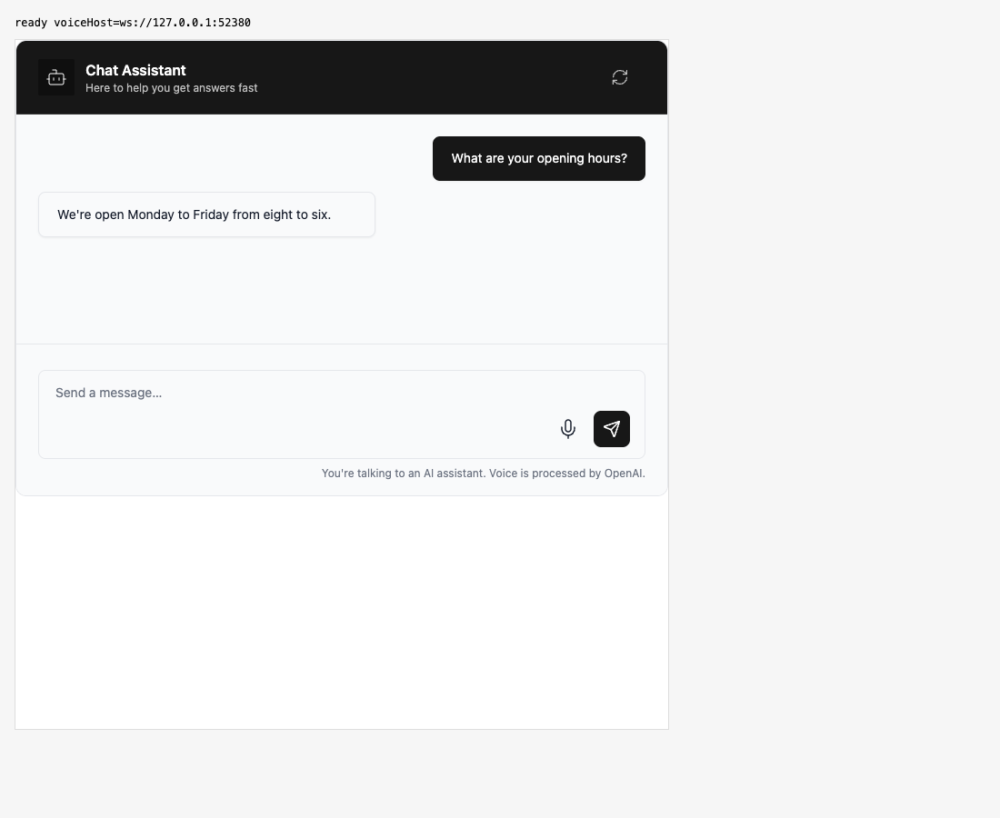

[`06-voice-runtype-after-call.aria.txt`](./06-voice-runtype-after-call.aria.txt)

**audio round trip**: `output.png` is the audio the widget played, tapped in-page (waveform over spectrogram): 2760 ms (mean -15.9 dB, peak -2.6 dB); `server-heard.png` is the mic PCM the voice socket received: 7680 ms in 30 frames; micOnToSocketOpen 0 ms, socketOpenToFirstMicFrame 285 ms, micOnToFirstAudioReceived 3776 ms

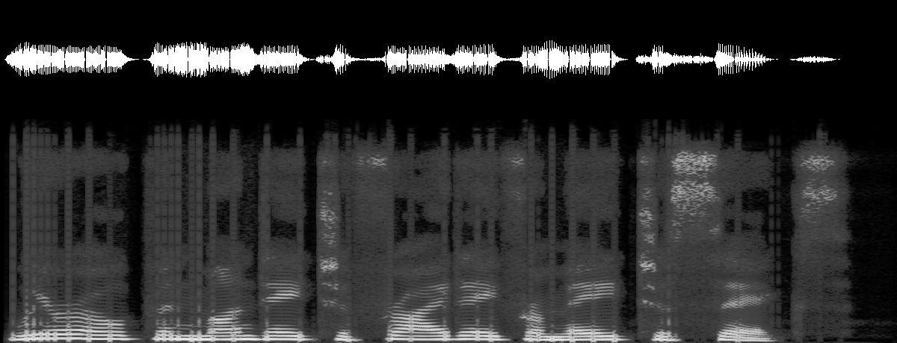

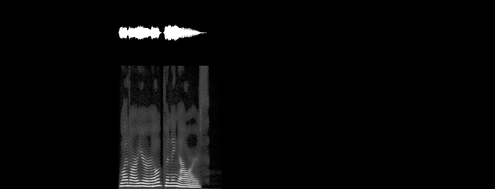

[`07-voice-runtype-audio-round-trip.output.wav`](./07-voice-runtype-audio-round-trip.output.wav) · [`07-voice-runtype-audio-round-trip.server-heard.wav`](./07-voice-runtype-audio-round-trip.server-heard.wav) · [`07-voice-runtype-audio-round-trip.voice.json`](./07-voice-runtype-audio-round-trip.voice.json)

### voice-browser

**dictation**

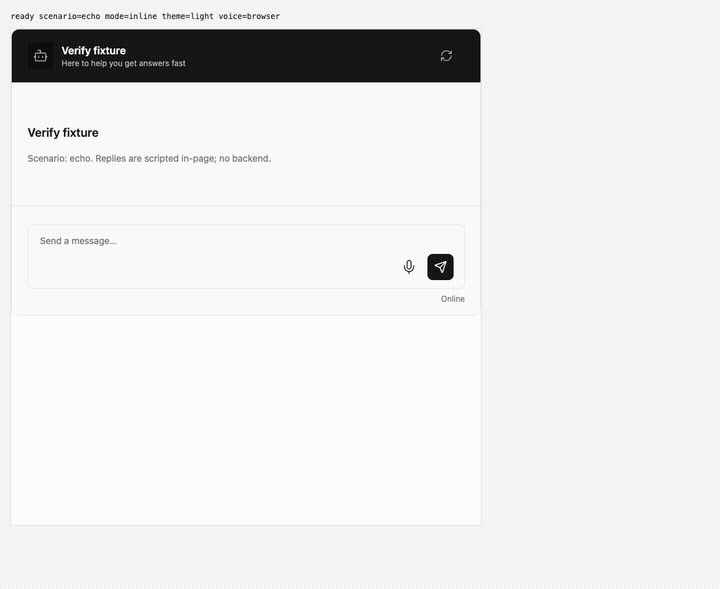

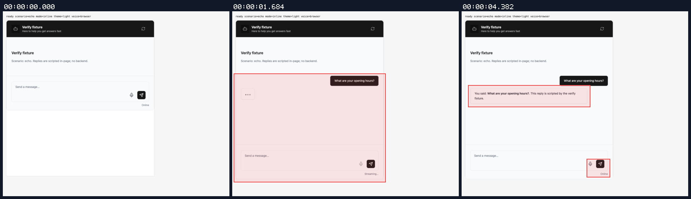

[`08-voice-browser-dictation.webm`](./08-voice-browser-dictation.webm)

**dictated turn answered**

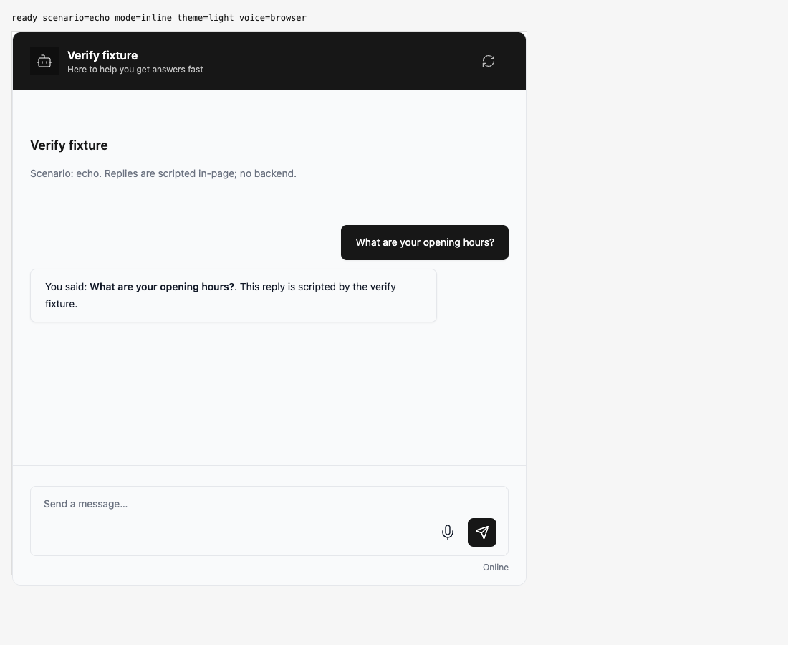

[`09-voice-browser-dictated-turn-answered.aria.txt`](./09-voice-browser-dictated-turn-answered.aria.txt)

**timeline**: 1 request(s) crossed the network boundary, 7 controller event(s); recognitionFinalToTtsStart 2157 ms; speechSynthesis spoke: "You said: What are your opening hours?. This reply is scripted by the verify fixture."

[`10-voice-browser-timeline.page.json`](./10-voice-browser-timeline.page.json) · [`10-voice-browser-timeline.voice.json`](./10-voice-browser-timeline.voice.json)

